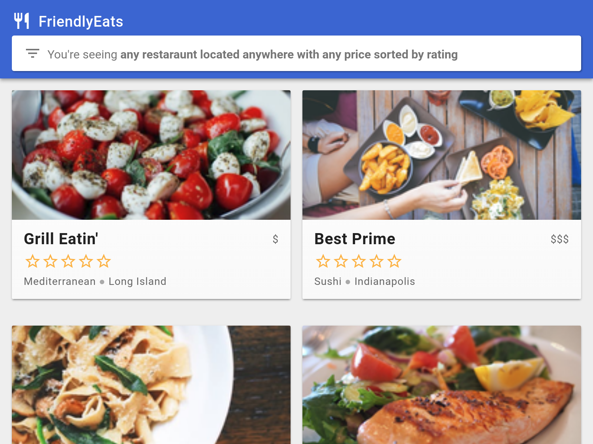

# FriendlyEats (Web)

## Introduction

FriendlyEats is a restaurant recommendation app built on Cloud Firestore.
For more information about Firestore visit [the docs][firestore-docs].

This project is the starting point for the [Cloud Firestore Web Codelab][codelab],
which will show you how to build the applications step-by-step. If you'd like to
simply run the finished result, see the [quickstart app][quickstart].



## Setup

Follow the [Cloud Firestore Web Codelab][codelab] to set up this sample.

## License

© Google, 2018. Licensed under an [Apache-2](./LICENSE) license.

## Build Status

[](https://travis-ci.org/firebase/friendlyeats-web)

[codelab]: https://codelabs.developers.google.com/codelabs/firestore-web
[quickstart]: https://github.com/firebase/quickstart-js/tree/master/firestore
[firestore-docs]: https://firebase.google.com/docs/firestore/

# create-svelte

Everything you need to build a Svelte project, powered by [`create-svelte`](https://github.com/sveltejs/kit/tree/master/packages/create-svelte).

## Creating a project

If you're seeing this, you've probably already done this step. Congrats!

```bash
# create a new project in the current directory
npm create svelte@latest

# create a new project in my-app
npm create svelte@latest my-app
```

## Developing

Once you've created a project and installed dependencies with `npm install` (or `pnpm install` or `yarn`), start a development server:

```bash
npm run dev

# or start the server and open the app in a new browser tab
npm run dev -- --open
```

## Building

To create a production version of your app:

```bash
npm run build
```

You can preview the production build with `npm run preview`.

> To deploy your app, you may need to install an [adapter](https://kit.svelte.dev/docs/adapters) for your target environment.
