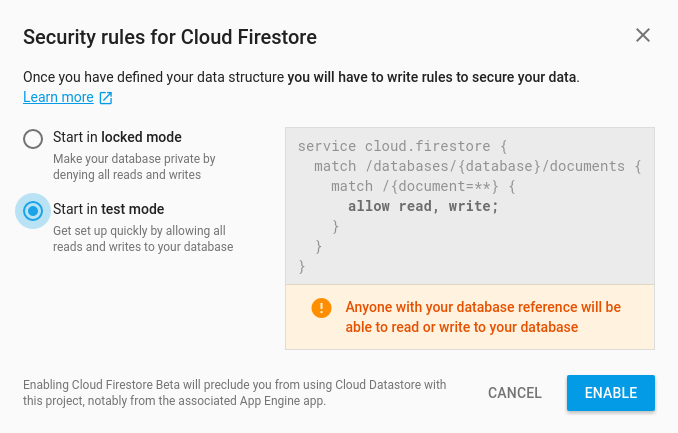
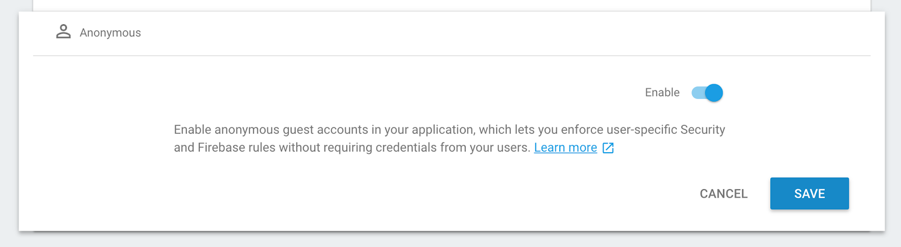
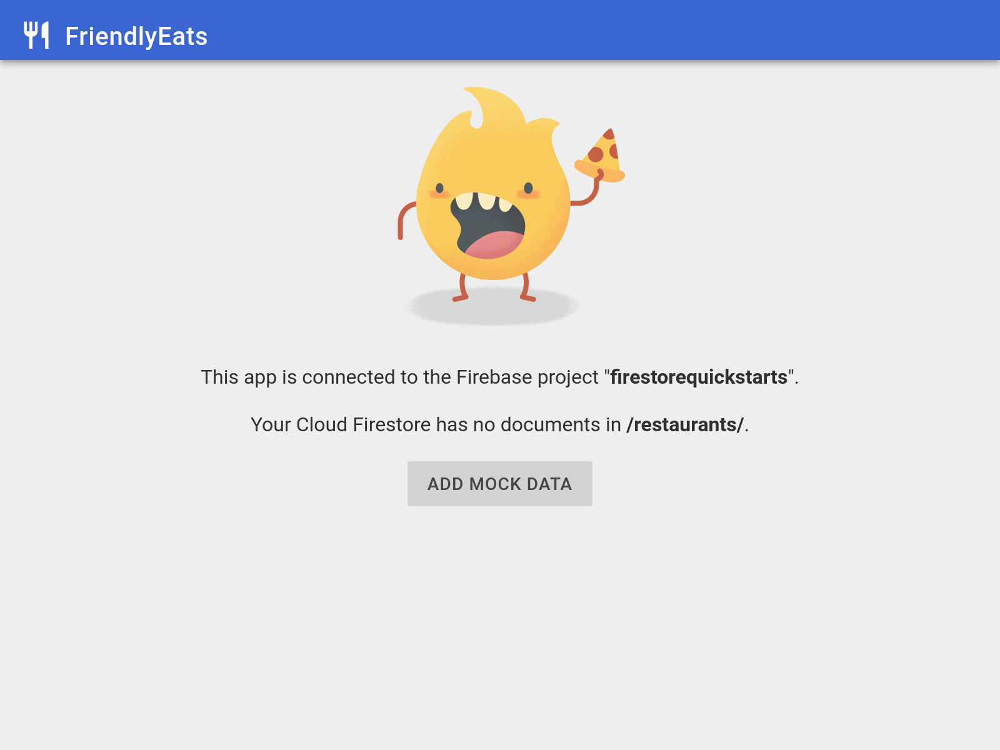

# Cloud Firestore Web Codelab

[Codelab Feedback](https://github.com/firebase/friendlyeats-web/issues)

## Overview

### Goals

In this codelab you will build a Firestore-backed restaurant recommendation Web app.  You will learn how to:

* Read and write data to Firestore from a Web app
* Listen to changes in Firestore data in realtime
* Use Firebase Authentication and security rules to secure Firestore data
* Write complex Firestore queries

### Prerequisites

Before starting this codelab make sure you have installed:

* Node.js

Note that although Node.js is a requirement for running and testing our app, the final application will not be dependent on Node.js.

## Get the Sample Project

### Download the Code

Begin by cloning the  [sample project](https://github.com/firebase/friendlyeats-web).

    git clone https://github.com/firebase/friendlyeats-web
    cd friendlyeats-web

Next, you'll need to get a Cloud Firestore enabled version of the Firebase CLI:

    npm install -g firebase-tools

### Create a Project

Follow  [the documentation](https://firebase.google.com/docs/firestore/quickstart) to create a new Firestore project.  If you are prompted to select your security rules, start with "**test mode**". We will change this later in the codelab.

### Set Up Firebase

Our Web app template is configured to automatically pull your project's configuration from the Firebase Hosting environment. However we still need to associate your project with the app.

    firebase use --add

You'll be prompted to give this project an alias. This is useful if you have multiple environments (production, staging, etc). However, for this example, let's just name it "default". Now we can use `firebase serve` to run our Web app and it will automatically know what Firebase (and Firestore) project to use.

## Enable Firebase Authentication

Although authentication isn't the focus of this codelab, it's important to have some form of authentication in our app. We'll use Anonymous login - this means the user will be silently logged in without being prompted.

You can enable Anonymous authentication in your app using the Firebase Console. Run the following command to be automatically taken to the **Authentication Providers** configuration page.

    firebase open auth

Alternatively, in the Firebase Console for you project go to **Authentication > Sign-In Method**

Once on this page, click on **Anonymous**, then click on **Enable** and click **Save**:

## Run the Local Server

We're ready to actually start work on our app! Lets run it locally with the `firebase` command.

    firebase serve

Now open your browser and view `localhost:5000`. You'll see your copy of FriendlyEats which has been connected to your Firebase project.

The app has automatically connected to our project and silently logged us in as an anonymous user.

## Write Data to Firestore

In this section we'll write some data to Firestore so that we can populate the app's UI. This can be done manually via the  [Firebase console](https://console.firebase.google.com), but we'll do it in the app itself to demonstrate a basic Firestore write.

The main model object in our app is a restaurant. Firestore data is split into documents, collections, and subcollections.  We will store each restaurant as a document in a top-level collection called `"restaurants"`. If you'd like to learn more about the Firestore data model, read about documents and collections in  [the documentation](https://firebase.google.com/docs/firestore/data-model).

Open `scripts/FriendlyEats.Data.js` and find the function `FriendlyEats.prototype.addRestaurant` and replace the entire function with the code below.

####  [FriendlyEats.Data.js](https://github.com/firebase/friendlyeats-web/blob/master/scripts/FriendlyEats.Data.js#L18-L22.js)

    FriendlyEats.prototype.addRestaurant = function(data) {
      var collection = firebase.firestore().collection('restaurants');
      return collection.add(data);
    };

The code above adds a new document to the `restaurants` collection. The document data comes from a plain JavaScript object. We do this by first getting a reference to a Firestore collection `restaurants` then `add`'ing the data.

### Security rules

We're almost there--before we can write documents to Firestore we need to open up Firestore's security rules and describe which parts of our database should be writeable by which users. For now, we'll allow only authenticated users to read and write to the entire database. This is a little too permissive for a production app, but during the app-building process we want something relaxed enough so we won't constantly run into authentication issues while experimenting. At the end of this codelab we'll talk about how to harden your security rules and limit the possibility of unintended reads and writes.

Open the Firebase console and navigate to  [Database > Rules in the Firestore tab](https://console.firebase.google.com/project/_/database/firestore/rules). The default rules prevent any reads or writes in the database from any user. Replace the defaults with the following rules.

####  [firestore.rules](https://github.com/firebase/friendlyeats-web/blob/master/firestore.rules)

    service cloud.firestore {
      match /databases/{database}/documents {
        match /{document=**} {
          // Only authenticated users can read or write data
          allow read, write: if request.auth != null;
        }
      }
    }

You can simply copy-paste the above in the Firebase Console and publish it. Alternatively you can also deploy these using a file through the command line. To do this run:

    firebase deploy --only firestore:rules

This will deploy the  [firestore.rules](https://github.com/firebase/friendlyeats-web/blob/master/firestore.rules) file which already contains the rule above.

<aside class="special">

**Note**: If you'd like to learn more about security rules have a look at the  [security rules documentation](https://firebase.google.com/docs/firestore/security/get-started). You can also have a look at  [this alternative firestore.rules](https://github.com/firebase/quickstart-js/blob/master/firestore/firestore.rules) file for FriendlyEats which sets more fined grained access control.
</aside>

Refresh the page and tap the "**Add Mock Data**" button, which will create a batch of restaurant documents, although **you won't yet see this in the app**. We still need to implement retrieving the data.

Next, navigate to the  [Firestore tab](https://console.firebase.google.com/project/_/database/firestore/data) in the Firebase console. You should now see new entries in the restaurant's collection:

Congratulations, you have just written data to Firestore from a Web app! In the next section you'll learn how to retrieve data from Firestore and display it in the app.

## Display Data from Firestore

In this section you will learn how to retrieve data from Firestore and display it in the app. The two key steps are creating a query and adding a snapshot listener. This listener will be notified of all existing data that matches the query and receive updates in real time.

First, let's construct the query that will serve the default, unfiltered list of restaurants. Put this code in the `FriendlyEats.prototype.getAllRestaurants()` method:

####  [FriendlyEats.Data.js](https://github.com/firebase/friendlyeats-web/blob/master/scripts/FriendlyEats.Data.js#L24-L28.js)

     var query = firebase.firestore()
       .collection('restaurants')
       .orderBy('avgRating', 'desc')
       .limit(50);
     this.getDocumentsInQuery(query, render);

In this snippet we create a query which will retrieve up to 50 restaurants of the top-level collection named "restaurants" which are ordered by the average rating (currently all zero). Once we've declared this query, we pass it to the `getDocumentsInQuery()` method which is responsible for loading and rendering the data. We'll do this by adding a snapshot listener. Add the following code to the `FriendlyEats.prototype.getDocumentsInQuery()` method:

####  [FriendlyEats.Data.js](https://github.com/firebase/friendlyeats-web/blob/master/scripts/FriendlyEats.Data.js#L30-L34.js)

     query.onSnapshot(function(snapshot) {
       if (!snapshot.size) return render();
    
       snapshot.docChanges().forEach(function(change) {
         if (change.type === 'added') {
           render(change.doc);
         }
       });
     });

The `query.onSnapshot` in the code above will trigger its callback every time there is a change to the result of the query. The first time, the callback is triggered with the whole result set of the query so with the whole `restaurants` collection from Firestore. It then passes all the individual documents to the `render` function. Keep in mind that `change.type` could also be `removed` or `changed` so we need to explicitly say that we're only interested in rendering the new document if it's being added.

Now that we've implemented both methods, refresh the app and verify that the restaurants we saw earlier in console are now visible in the app.  If you completed this section successfully your app is now reading and writing data with Cloud Firestore!

As your list of restaurants changes, this listener will keep updating automatically. Try going to the Firebase Console and adding a restaurant by hand - you'll see it show up on your site immediately!

<aside class="special">

**Note**: It is also possible to fetch documents from Firestore once, rather than listening for real time updates using the `Query.get()` method.
</aside>

## Get()'ing data

So far we've shown how to use `onSnapshot` to retrieve updates in realtime, however that's not always what we want. Sometimes it makes more sense to only fetch the data once.

Let's implement the `FriendlyEats.prototype.getRestaurant()` method which is used when you click into a specific restaurant. 

####  [FriendlyEats.Data.js](https://github.com/firebase/friendlyeats-web/blob/master/scripts/FriendlyEats.Data.js#L36-L40.js)

    FriendlyEats.prototype.getRestaurant = function(id) {
      return firebase.firestore().collection('restaurants').doc(id).get();
    };

Once you've implemented this you'll be able to view pages for each location and leave reviews which will be reflected in the main list.

## Sorting and Filtering data

Currently our app displays a list of restaurants, but there is no way for the user to filter based on their needs.  In this section you will use Firestore's advanced querying to enable filtering.

Here's an example of a simple query to fetch all Dim Sum restaurants:

    var filteredQuery = query.where('category', '==', 'Dim Sum')

As its name implies, the `where()` method will make our query download only members of the collection whose fields meet the restrictions we set. In this case, it'll only download restaurants where `category` is `"Dim Sum"`.

In this app the user can chain multiple filters to create specific queries, like "Pizza in San Francisco" or "Seafood in Los Angeles ordered by Popularity". 

Take a look at the `FriendlyEats.prototype.getFilteredRestaurants()` method. In this method we'll build up a query which will filter our restaurants based on multiple criteria. Add the following code to the method.

####  [FriendlyEats.Data.js](https://github.com/firebase/friendlyeats-web/blob/master/scripts/FriendlyEats.Data.js#L42-L46.js)

    var query = firebase.firestore().collection('restaurants');
    
    if (filters.category !== 'Any') {
      query = query.where('category', '==', filters.category);
    }
    
    if (filters.city !== 'Any') {
      query = query.where('city', '==', filters.city);
    }
    
    if (filters.price !== 'Any') {
      query = query.where('price', '==', filters.price.length);
    }
    
    if (filters.sort === 'Rating') {
      query = query.orderBy('avgRating', 'desc');
    } else if (filters.sort === 'Reviews') {
      query = query.orderBy('numRatings', 'desc');
    }
    
    this.getDocumentsInQuery(query, render);

The snippet above adds multiple `where` filters and a single `orderBy` clause to build a compound query based on user input. Now our query will only return restaurants that match the user's requirements.

Run your project and verify you can filter by price, city, and category. While testing you'll see errors in your logs that look like this:

    The query requires an index. You can create it here: https://console.firebase.google.com/project/.../database/firestore/indexes?create_index=...

This is because Firestore requires indexes for most compound queries. Requiring indexes on queries keeps Firestore fast at scale.  Opening the link from the error message will automatically open the index creation UI in the Firebase console with the correct parameters filled in. To learn more about indexes in Firestore,  [visit the documentation](https://firebase.google.com/docs/firestore/query-data/indexing).

## Deploying Indexes

If we don't want to explore every path in our application and follow each of the index creation links, we can easily deploy many indexes at once using the `firebase` command.

In your repo, you'll find a `firestore.indexes.json` file.

####  [firestore.indexes.json](https://github.com/firebase/friendlyeats-web/blob/master/firestore.indexes.json)

    {
     "indexes": [
       {
         "collectionId": "restaurants",
         "fields": [
           { "fieldPath": "city", "mode": "ASCENDING" },
           { "fieldPath": "avgRating", "mode": "DESCENDING" }
         ]
       },
       ...
     ]
    }

This file describes all the indexes needed for all the possible combinations of filters.

Deploy these indexes with:

    firebase deploy --only firestore:indexes

After a few minutes, your indexes will be live and the warning messages will go away.

## Writing data in a transaction

In this section, we'll add the ability for users to submit reviews to restaurants. Thus far, all of our writes have been atomic and relatively simple. If any of them errored, we'd likely just prompt the user to retry them or retry them automatically. 

In order to add a rating to a restaurant we need to coordinate multiple reads and writes. First the review itself has to be submitted, and then the restaurant's rating count and average rating need to be updated. If one of these fails but not the other, we're left in an inconsistent state where the data in one part of our database doesn't match the data in another.

Fortunately, Firestore provides transaction functionality that lets us perform multiple reads and writes in a single atomic operation, ensuring that our data remains consistent.

Add the following code in the `FriendlyEats.prototype.addRating()` method.

####  [FriendlyEats.Data.js](https://github.com/firebase/friendlyeats-web/blob/master/scripts/FriendlyEats.Data.js#L48-L52.js)

     var collection = firebase.firestore().collection('restaurants');
     var document = collection.doc(restaurantID);
    
     return document.collection('ratings').add(rating).then(function() {
       return firebase.firestore().runTransaction(function(transaction) {
         return transaction.get(document).then(function(doc) {
           var data = doc.data();
    
           var newAverage =
             (data.numRatings * data.avgRating + rating.rating) /
             (data.numRatings + 1);
    
           return transaction.update(document, {
             numRatings: data.numRatings + 1,
             avgRating: newAverage
           });
         });
       });
     });

In this block we will first add the review to the `ratings` subcollection of the restaurant. Once this write has succeeded, we'll trigger a transaction to update the numeric values of `averageRating` and `ratingCount` on the restaurant itself.

<aside class="warning">

**Note**: When a transaction fails on the server, the callback is also re-executed repeatedly. Never place logic that modifies app state inside the transaction callback.
</aside>

## Conclusion

In this codelab, you learned how to perform basic and advanced reads and writes with Firestore, as well as how to secure data access with security rules. You can find the full solution in the  [quickstarts-js repository](https://github.com/firebase/quickstart-js/tree/master/firestore).

To learn more about Firestore, visit the following resources:

*  [Introduction to Cloud Firestore](https://firebase.google.com/docs/firestore/)
*  [Choosing a Data Structure](https://firebase.google.com/docs/firestore/manage-data/structure-data)
*  [Firestore Web Samples](https://firebase.google.com/docs/firestore/client/samples-web)

