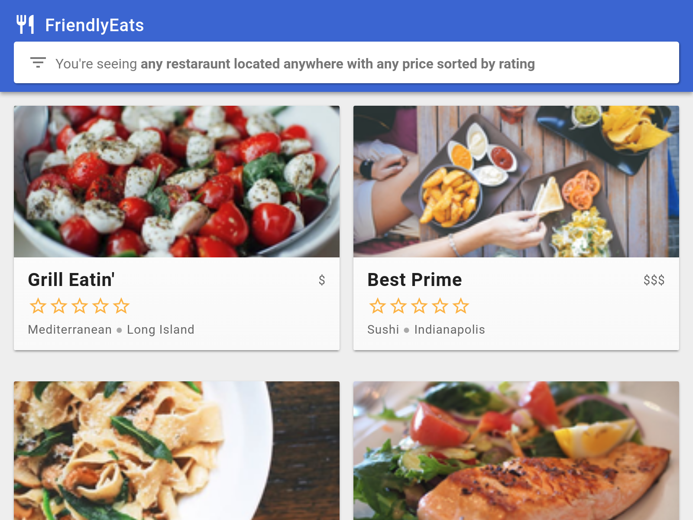
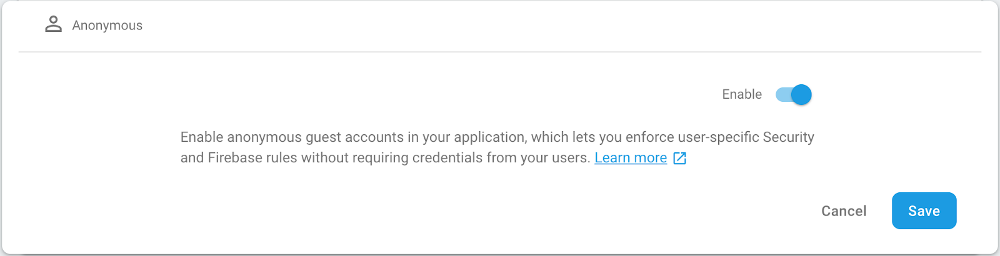
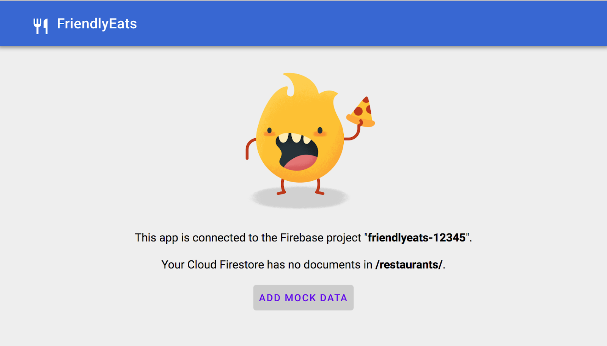
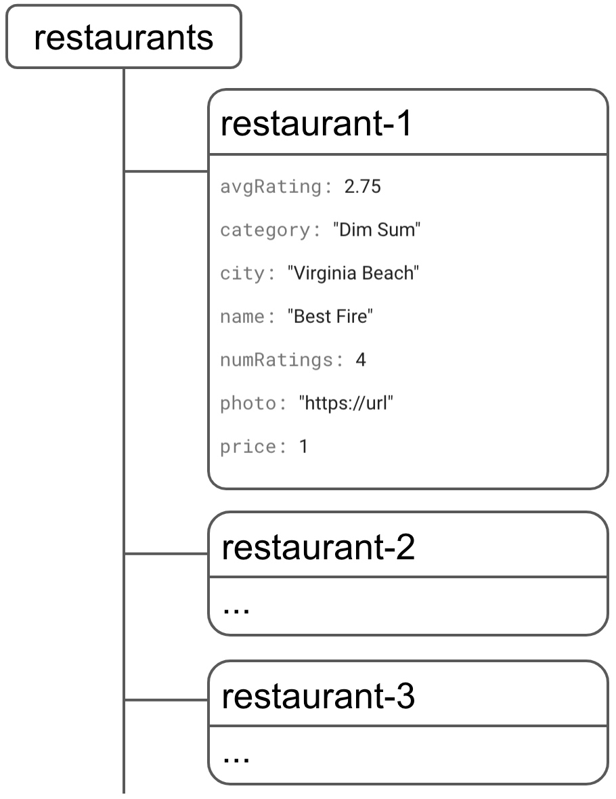
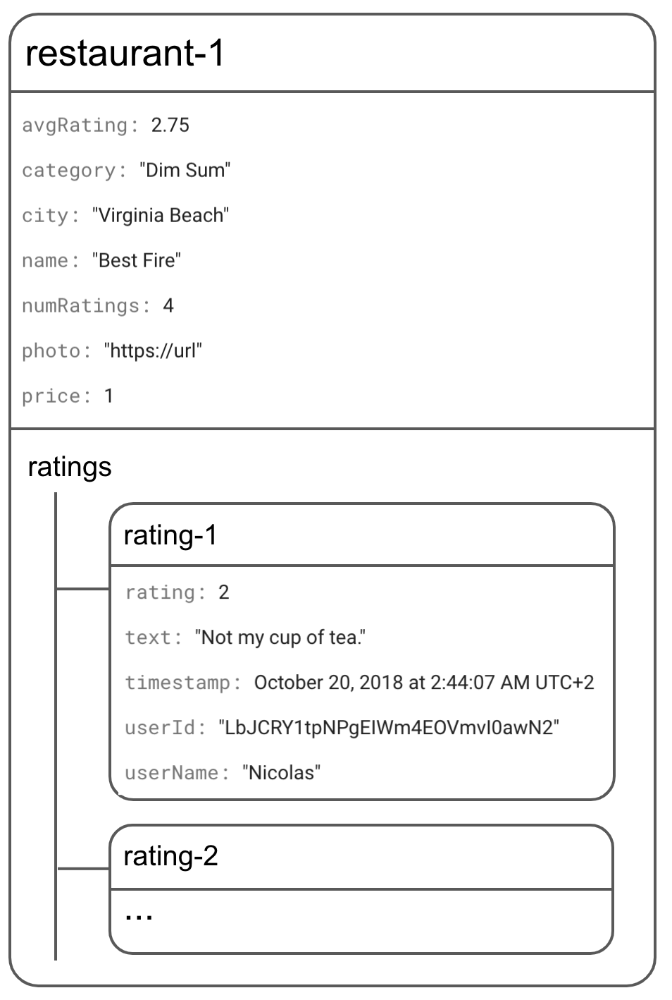
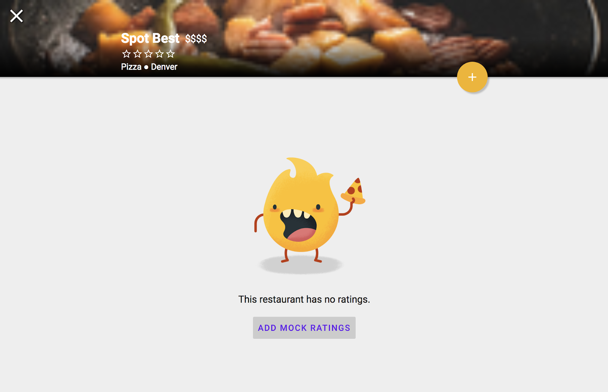

# Cloud Firestore Web Codelab

[Codelab Feedback](https://github.com/firebase/friendlyeats-web/issues)


## Overview
Duration: 01:00

> aside negative
This codelab uses v8 of the Firebase JavaScript SDKs. It is recommended that you use
v9 for your applications. This codelab will soon be updated to v9. The concepts
described in this codelab are still valid. See Firebase documentation to
[learn more about SDK versions 8 and 9](https://firebase.google.com/docs/web/learn-more?authuser=0#modular-version).

### Goals

In this codelab, you'll build a restaurant recommendation web app powered by  [Cloud Firestore](https://firebase.google.com/docs/firestore/). 



#### **What you'll learn**

* Read and write data to Cloud Firestore from a web app
* Listen to changes in Cloud Firestore data in real time
* Use Firebase Authentication and security rules to secure Cloud Firestore data
* Write complex Cloud Firestore queries

#### **What you'll need**

Before starting this codelab, make sure that you've installed:

*  [npm](https://www.npmjs.com/) which typically comes with  [Node.js](https://nodejs.org/en/) - Node v8 is recommended
* The IDE/text editor of your choice, such as  [WebStorm](https://www.jetbrains.com/webstorm),  [Atom](https://atom.io/),  [VS Code](https://code.visualstudio.com/), or  [Sublime](https://www.sublimetext.com/)

> aside positive
> 
> **Note**:  Although Node.js is a requirement for running and testing our app during development, the final application will not be dependent on Node.js.


## Create and set up a Firebase project
Duration: 05:00


### Create a Firebase project

1. In the  [Firebase console](https://console.firebase.google.com), click **Add project**, then name the Firebase project **FriendlyEats**.

> Remember the Project ID for your Firebase project.

2. Click **Create project**.

> aside positive
> 
> **Important**:  Your Firebase project will be named **FriendlyEats**, but Firebase will automatically assign it a unique Project ID in the form **friendlyeats-1234**.  This unique identifier is how your project is actually identified (including in the CLI), whereas *FriendlyEats* is simply a display name.

The application that we're going to build uses a few Firebase services available on the web:

* **Firebase Authentication** to easily identify your users
* **Cloud Firestore** to save structured data on the Cloud and get instant notification when the data is updated
* **Firebase Hosting** to host and serve your static assets

For this specific codelab, we've already configured Firebase Hosting.  However, for Firebase Auth and Cloud Firestore,  we'll walk you through the configuration and enabling of the services using the Firebase console.

### Enable Anonymous Auth

Although authentication isn't the focus of this codelab, it's important to have some form of authentication in our app. We'll use **Anonymous login** - meaning that the user will be silently signed in without being prompted.

You'll need to enable **Anonymous login.**

1. In the Firebase console, locate the **Build** section in the left nav.
2. Click **Authentication**, then click the **Sign-in method** tab (or [click here](https://console.firebase.google.com/project/_/authentication/providers) to go directly there).
3. Enable the **Anonymous** Sign-in Provider, then click **Save**.



This will allow the application to silently sign in your users when they access the web app. Feel free to read the  [Anonymous Authentication documentation](https://firebase.google.com/docs/auth/web/anonymous-auth) to learn more.

### Enable Cloud Firestore

The app uses Cloud Firestore to save and receive restaurant information and ratings.

You'll need to enable Cloud Firestore.  In the Firebase console's **Build** section, click **Firestore Database**. Click **Create database** in the Cloud Firestore pane.

Access to data in Cloud Firestore is controlled by Security Rules.  We'll talk more about rules later in this codelab but first we need to set some basic rules on our data to get started.  In the  [Rules tab](https://console.firebase.google.com/project/_/database/firestore/rules) of the Firebase console add the following rules and then click **Publish**.

```console
service cloud.firestore {
  match /databases/{database}/documents {
    match /{document=**} {
      //
      // WARNING: These rules are insecure! We will replace them with
      // more secure rules later in the codelab
      //
      allow read, write: if request.auth != null;
    }
  }
}
```

The rules above restrict data access to users who are signed in, which prevents unauthenticated users from reading or writing.  This is better than allowing public access but is still far from secure, we will improve these rules later in the codelab.


## Get the sample code
Duration: 02:00


Clone the  [GitHub repository](https://github.com/firebase/friendlyeats-web) from the command line:

```console
git clone https://github.com/firebase/friendlyeats-web
```

The sample code should have been cloned into the 📁`friendlyeats-web` directory. From now on, make sure to run all your commands from this directory: 

```console
cd friendlyeats-web
```

#### **Import the starter app**

Using your IDE (WebStorm, Atom, Sublime, Visual Studio Code...) open or import the 📁`friendlyeats-web` directory. This directory contains the starting code for the codelab which consists of a not-yet functional restaurant recommendation app. We'll make it functional throughout this codelab so you will need to edit code in that directory soon.


## Install the Firebase Command Line Interface
Duration: 02:00


The Firebase Command Line Interface (CLI) allows you to serve your web app locally and deploy your web app to Firebase Hosting.

> aside positive
> 
> **Note**:  To install the CLI, you need to install  [npm](https://www.npmjs.com/) which typically comes with  [NodeJS](https://nodejs.org/en/).

1. Install the CLI by running the following npm command:

```console
npm -g install firebase-tools
```

> aside negative
> 
> Doesn't work? You may need to  [change npm permissions.](https://docs.npmjs.com/getting-started/fixing-npm-permissions)

2. Verify that the CLI has been installed correctly by running the following command:

```console
firebase --version
```

Make sure the version of the Firebase CLI is v7.4.0 or later.

3. Authorize the Firebase CLI by running the following command:

```console
firebase login
```

We've set up the web app template to pull your app's configuration for Firebase Hosting from your app's local directory and files. But to do this, we need to associate your app with your Firebase project.

4. Make sure that your command line is accessing your app's local directory.

5. Associate your app with your Firebase project by running the following command:

```console
firebase use --add
```

6. When prompted, select your **Project ID**, then give your Firebase project an alias.

An alias is useful if you have multiple environments (production, staging, etc). However, for this codelab, let's just use the alias of `default`.

7. Follow the remaining instructions in your command line.


## Run the local server
Duration: 01:00


We're ready to actually start work on our app! Let's run our app locally! 

1.  Run the following Firebase CLI command:

```console
firebase emulators:start --only hosting
```

2. Your command line should display the following response:

```console
hosting: Local server: http://localhost:5000
```

We're using the  [Firebase Hosting](https://firebase.google.com/docs/hosting/) emulator to serve our app locally. The web app should now be available from  [http://localhost:5000](http://localhost:5000).

3. Open your app at  [http://localhost:5000](http://localhost:5000).

You should see your copy of FriendlyEats which has been connected to your Firebase project.

The app has automatically connected to your Firebase project and silently signed you in as an anonymous user.




## Write data to Cloud Firestore
Duration: 05:00


In this section, we'll write some data to Cloud Firestore so that we can populate the app's UI. This can be done manually via the  [Firebase console](https://console.firebase.google.com), but we'll do it in the app itself to demonstrate a basic Cloud Firestore write.

### Data Model

Firestore data is split into collections, documents, fields, and subcollections. We will store each restaurant as a document in a top-level collection called `restaurants`.



Later, we'll store each review in a subcollection called `ratings` under each restaurant.



> aside positive
> 
> **Tip**: To learn more about the Firestore data model, read about documents and collections in  [the documentation](https://firebase.google.com/docs/firestore/data-model).

### Add restaurants to Firestore

The main model object in our app is a restaurant. Let's write some code that adds a restaurant document to the `restaurants` collection.

1. From your downloaded files, open `scripts/FriendlyEats.Data.js`.
2. Find the function `FriendlyEats.prototype.addRestaurant`.
3. Replace the entire function with the following code.

####  [FriendlyEats.Data.js](https://github.com/firebase/friendlyeats-web/blob/master/scripts/FriendlyEats.Data.js#L18-L22.js)

```console
FriendlyEats.prototype.addRestaurant = function(data) {
  var collection = firebase.firestore().collection('restaurants');
  return collection.add(data);
};
```

The code above adds a new document to the `restaurants` collection. The document data comes from a plain JavaScript object. We do this by first getting a reference to a Cloud Firestore collection `restaurants` then `add`'ing the data.

### Let's add restaurants!

1. Go back to your FriendlyEats app in your browser and refresh it.
2. Click **Add Mock Data**.

The app will automatically generate a random set of restaurants objects, then call your `addRestaurant` function. However, ***you won't yet see the data in your actual web app*** because we still need to implement *retrieving* the data (the next section of the codelab).

If you navigate to the  [Cloud Firestore tab](https://console.firebase.google.com/project/_/database/firestore/data) in the Firebase console, though, you should now see new documents in the `restaurants` collection!


Congratulations, you have just written data to Cloud Firestore from a web app!

In the next section, you'll learn how to retrieve data from Cloud Firestore and display it in your app.


## Display data from Cloud Firestore
Duration: 05:00


In this section, you'll learn how to retrieve data from Cloud Firestore and display it in your app. The two key steps are creating a query and adding a snapshot listener. This listener will be notified of all existing data that matches the query and will receive updates in real time.

First, let's construct the query that will serve the default, unfiltered list of restaurants.

1. Go back to the file `scripts/FriendlyEats.Data.js`.
2. Find the function `FriendlyEats.prototype.getAllRestaurants`.
3. Replace the entire function with the following code.

####  [FriendlyEats.Data.js](https://github.com/firebase/friendlyeats-web/blob/master/scripts/FriendlyEats.Data.js#L24-L28.js)

```console
FriendlyEats.prototype.getAllRestaurants = function(renderer) {
  var query = firebase.firestore()
      .collection('restaurants')
      .orderBy('avgRating', 'desc')
      .limit(50);

  this.getDocumentsInQuery(query, renderer);
};
```

In the code above, we construct a query which will retrieve up to 50 restaurants from the top-level collection named `restaurants`, which are ordered by the average rating (currently all zero). After we declared this query, we pass it to the `getDocumentsInQuery()` method which is responsible for loading and rendering the data.

We'll do this by adding a snapshot listener.

1. Go back to the file `scripts/FriendlyEats.Data.js`.
2. Find the function `FriendlyEats.prototype.getDocumentsInQuery`.
3. Replace the entire function with the following code.

####  [FriendlyEats.Data.js](https://github.com/firebase/friendlyeats-web/blob/master/scripts/FriendlyEats.Data.js#L30-L34.js)

```console
FriendlyEats.prototype.getDocumentsInQuery = function(query, renderer) {
  query.onSnapshot(function(snapshot) {
    if (!snapshot.size) return renderer.empty(); // Display "There are no restaurants".

    snapshot.docChanges().forEach(function(change) {
      if (change.type === 'removed') {
        renderer.remove(change.doc);
      } else {
        renderer.display(change.doc);
      }
    });
  });
};
```

In the code above, `query.onSnapshot` will trigger its callback every time there's a change to the result of the query.

* The first time, the callback is triggered with the entire result set of the query -- meaning the whole `restaurants` collection from Cloud Firestore. It then passes all the individual documents to the `renderer.display` function.
* When a document is deleted, `change.type` equals to `removed`. So in this case, we'll call a function that removes the restaurant from the UI.

Now that we've implemented both methods, refresh the app and verify that the restaurants we saw earlier in the Firebase console are now visible in the app. If you completed this section successfully, then your app is now reading and writing data with Cloud Firestore!

As your list of restaurants changes, this listener will keep updating automatically. Try going to the Firebase console and manually deleting a restaurant or changing its name - you'll see the changes show up on your site immediately!

> aside positive
> 
> **Note**:  It's also possible to fetch documents from Cloud Firestore once, rather than listening for real time updates using the `Query.get()` method.


## Get() data
Duration: 05:00


So far, we've shown how to use `onSnapshot` to retrieve updates in real time; however, that's not always what we want. Sometimes it makes more sense to only fetch the data once.

We'll want to implement a method that's triggered when a user clicks into a specific restaurant in your app.

1. Go back to your file `scripts/FriendlyEats.Data.js`.
2. Find the function `FriendlyEats.prototype.getRestaurant`.
3. Replace the entire function with the following code.

####  [FriendlyEats.Data.js](https://github.com/firebase/friendlyeats-web/blob/master/scripts/FriendlyEats.Data.js#L36-L40.js)

```console
FriendlyEats.prototype.getRestaurant = function(id) {
  return firebase.firestore().collection('restaurants').doc(id).get();
};
```

After you've implemented this method, you'll be able to view pages for each restaurant. Just click on a restaurant in the list and you should see the restaurant's details page:



For now, you can't add ratings as we still need to implement adding ratings later on in the codelab.


## Sort and filter data
Duration: 05:00


Currently, our app displays a list of restaurants, but there's no way for the user to filter based on their needs. In this section, you'll use Cloud Firestore's advanced querying to enable filtering.

Here's an example of a simple query to fetch all `Dim Sum` restaurants:

```console
var filteredQuery = query.where('category', '==', 'Dim Sum')
```

As its name implies, the `where()` method will make our query download only members of the collection whose fields meet the restrictions we set. In this case, it'll only download restaurants where `category` is `Dim Sum`.

In our app, the user can chain multiple filters to create specific queries, like "Pizza in San Francisco" or "Seafood in Los Angeles ordered by Popularity".

We'll create a method that builds up a query which will filter our restaurants based on multiple criteria selected by our users.

1. Go back to your file `scripts/FriendlyEats.Data.js`.
2. Find the function `FriendlyEats.prototype.getFilteredRestaurants`.
3. Replace the entire function with the following code.

####  [FriendlyEats.Data.js](https://github.com/firebase/friendlyeats-web/blob/master/scripts/FriendlyEats.Data.js#L42-L46.js)

```console
FriendlyEats.prototype.getFilteredRestaurants = function(filters, renderer) {
  var query = firebase.firestore().collection('restaurants');

  if (filters.category !== 'Any') {
    query = query.where('category', '==', filters.category);
  }

  if (filters.city !== 'Any') {
    query = query.where('city', '==', filters.city);
  }

  if (filters.price !== 'Any') {
    query = query.where('price', '==', filters.price.length);
  }

  if (filters.sort === 'Rating') {
    query = query.orderBy('avgRating', 'desc');
  } else if (filters.sort === 'Reviews') {
    query = query.orderBy('numRatings', 'desc');
  }

  this.getDocumentsInQuery(query, renderer);
};
```

The code above adds multiple `where` filters and a single `orderBy` clause to build a compound query based on user input. Our query will now only return restaurants that match the user's requirements.

Refresh your FriendlyEats app in your browser, then verify that you can filter by price, city, and category. While testing, you'll see errors in the JavaScript Console of your browser that look like this:

```console
The query requires an index. You can create it here: https://console.firebase.google.com/project/.../database/firestore/indexes?create_index=...
```

These errors are because Cloud Firestore requires indexes for most compound queries. Requiring indexes on queries keeps Cloud Firestore fast at scale.

Opening the link from the error message will automatically open the index creation UI in the Firebase console with the correct parameters filled in. In the next section, we'll write and deploy the indexes needed for this application.


## Deploy indexes
Duration: 05:00


If we don't want to explore every path in our app and follow each of the index creation links, we can easily deploy many indexes at once using the Firebase CLI.

1. In your app's downloaded local directory, you'll find a `firestore.indexes.json` file.

This file describes all the indexes needed for all the possible combinations of filters.

####  [firestore.indexes.json](https://github.com/firebase/friendlyeats-web/blob/master/firestore.indexes.json)

```console
{
 "indexes": [
   {
     "collectionGroup": "restaurants",
     "queryScope": "COLLECTION",
     "fields": [
       { "fieldPath": "city", "order": "ASCENDING" },
       { "fieldPath": "avgRating", "order": "DESCENDING" }
     ]
   },

   ...

 ]
}
```

2. Deploy these indexes with the following command:

```console
firebase deploy --only firestore:indexes
```

After a few minutes, your indexes will be live and the error messages will go away.

> aside positive
> 
> **Tip**:  To learn more about indexes in Cloud Firestore,  [visit the documentation](https://firebase.google.com/docs/firestore/query-data/indexing). 


## Write data in a transaction
Duration: 05:00


In this section, we'll add the ability for users to submit reviews to restaurants. So far, all of our writes have been atomic and relatively simple. If any of them errored, we'd likely just prompt the user to retry them or our app would retry the write automatically.

Our app will have many users who want to add a rating for a restaurant, so we'll need to coordinate multiple reads and writes. First the review itself has to be submitted, then the restaurant's rating `count` and `average rating` need to be updated. If one of these fails but not the other, we're left in an inconsistent state where the data in one part of our database doesn't match the data in another.

Fortunately, Cloud Firestore provides transaction functionality that allows us to perform multiple reads and writes in a single atomic operation, ensuring that our data remains consistent.

1. Go back to your file `scripts/FriendlyEats.Data.js`.
2. Find the function `FriendlyEats.prototype.addRating`.
3. Replace the entire function with the following code.

####  [FriendlyEats.Data.js](https://github.com/firebase/friendlyeats-web/blob/master/scripts/FriendlyEats.Data.js#L48-L52.js)

```console
FriendlyEats.prototype.addRating = function(restaurantID, rating) {
  var collection = firebase.firestore().collection('restaurants');
  var document = collection.doc(restaurantID);
  var newRatingDocument = document.collection('ratings').doc();

  return firebase.firestore().runTransaction(function(transaction) {
    return transaction.get(document).then(function(doc) {
      var data = doc.data();

      var newAverage =
          (data.numRatings * data.avgRating + rating.rating) /
          (data.numRatings + 1);

      transaction.update(document, {
        numRatings: data.numRatings + 1,
        avgRating: newAverage
      });
      return transaction.set(newRatingDocument, rating);
    });
  });
};
```

In the block above, we trigger a transaction to update the numeric values of `avgRating` and `numRatings` in the restaurant document. At the same time, we add the new `rating` to the `ratings` subcollection.

> aside positive
> 
> **Note**:  Adding ratings is a good example for using a transaction for this particular codelab. However, in a production app you should perform the average rating calculation on a trusted server to avoid manipulation by users. A good way to do this is to write the rating document directly from the client, then use  [Cloud Functions](https://firebase.google.com/docs/functions/) to update the new restaurant average rating.

> aside negative
> 
> **Warning**:  When a transaction fails on the server, the callback is also re-executed repeatedly. Never place logic that modifies app state inside the transaction callback.


## Secure your data
Duration: 05:00


At the beginning of this codelab, we set our app's security rules to completely open the database to any read or write. ***In a real application, we'd want to set much more fine-grained rules to prevent undesirable data access or modification.***

1. In the Firebase console's **Build** section, click **Firestore Database**.
2. Click the **Rules** tab in the Cloud Firestore section (or  [click here](https://console.firebase.google.com/project/_/database/firestore/rules) to go directly there).
3. Replace the defaults with the following rules, then click **Publish**.

####  [firestore.rules](https://github.com/firebase/friendlyeats-web/blob/master/firestore.rules)

```console
rules_version = '2';
service cloud.firestore {

  // Determine if the value of the field "key" is the same
  // before and after the request.
  function unchanged(key) {
    return (key in resource.data) 
      && (key in request.resource.data) 
      && (resource.data[key] == request.resource.data[key]);
  }

  match /databases/{database}/documents {
    // Restaurants:
    //   - Authenticated user can read
    //   - Authenticated user can create/update (for demo purposes only)
    //   - Updates are allowed if no fields are added and name is unchanged
    //   - Deletes are not allowed (default)
    match /restaurants/{restaurantId} {
      allow read: if request.auth != null;
      allow create: if request.auth != null;
      allow update: if request.auth != null
                    && (request.resource.data.keys() == resource.data.keys()) 
                    && unchanged("name");
      
      // Ratings:
      //   - Authenticated user can read
      //   - Authenticated user can create if userId matches
      //   - Deletes and updates are not allowed (default)
      match /ratings/{ratingId} {
        allow read: if request.auth != null;
        allow create: if request.auth != null
                      && request.resource.data.userId == request.auth.uid;
      }
    }
  }
}
```

These rules restrict access to ensure that clients only make safe changes. For example: 

* Updates to a restaurant document can only change the ratings, not the name or any other immutable data.
* Ratings can only be created if the user ID matches the signed-in user, which prevents spoofing.

Alternatively to using the Firebase console, you can use the Firebase CLI to deploy rules to your Firebase project. The  [firestore.rules](https://github.com/firebase/friendlyeats-web/blob/master/firestore.rules) file in your working directory already contains the rules from above. To deploy these rules from your local filesystem (rather than using the Firebase console), you'd run the following command:

```console
firebase deploy --only firestore:rules
```

> aside positive
> 
> **Important**:  To learn more about security rules, have a look at the  [security rules documentation](https://firebase.google.com/docs/firestore/security/get-started).


## Conclusion
Duration: 01:00


In this codelab, you learned how to perform basic and advanced reads and writes with Cloud Firestore, as well as how to secure data access with security rules. You can find the full solution in the  [quickstarts-js repository](https://github.com/firebase/quickstart-js/tree/master/firestore).

To learn more about Cloud Firestore, visit the following resources:

*  [Introduction to Cloud Firestore](https://firebase.google.com/docs/firestore/)
*  [Choosing a Data Structure](https://firebase.google.com/docs/firestore/manage-data/structure-data)
*  [Cloud Firestore Web Samples](https://firebase.google.com/docs/firestore/client/samples-web)
